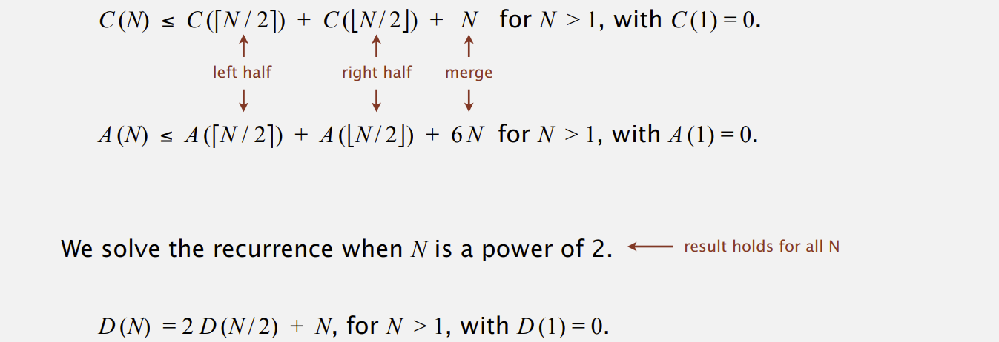
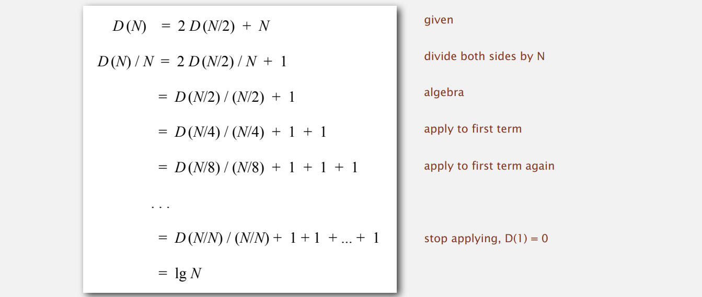
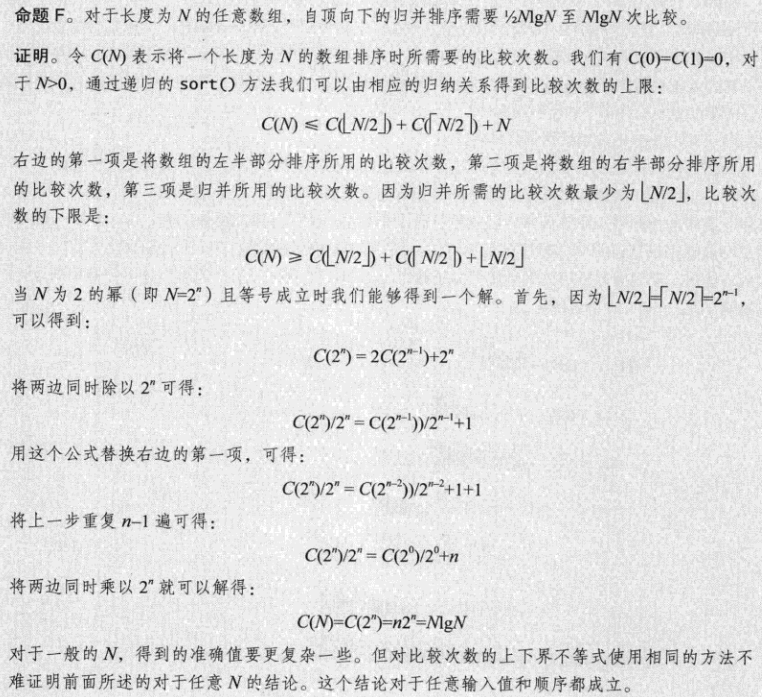
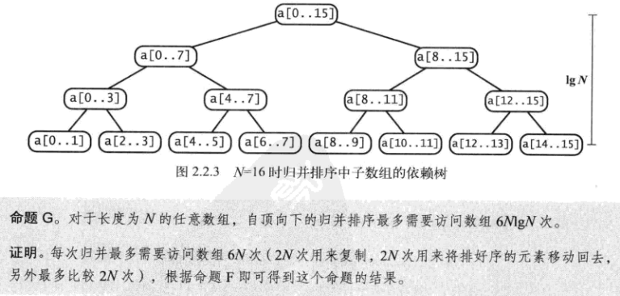

# Merge Sort

## ‣ Inplace & Up-bottom Merge Sort 

```java
private static void merge(Comparable[] a, Comparable[] aux, int lo, int mid, int hi) {
    // precondition: a[lo .. mid] and a[mid+1 .. hi] are sorted subarrays
    assert isSorted(a, lo, mid);
    assert isSorted(a, mid+1, hi);

    // copy to aux[]
    for (int k = lo; k <= hi; k++) {
        aux[k] = a[k];
    }

    // merge back to a[]
    int i = lo, j = mid+1;
    for (int k = lo; k <= hi; k++) {
        if      (i > mid)              a[k] = aux[j++];
        else if (j > hi)               a[k] = aux[i++];
        else if (less(aux[j], aux[i])) a[k] = aux[j++];
        else                           a[k] = aux[i++];
    }

    // postcondition: a[lo .. hi] is sorted
    assert isSorted(a, lo, hi);
}


// mergesort a[lo..hi] using auxiliary array aux[lo..hi]
private static void sort(Comparable[] a, Comparable[] aux, int lo, int hi) {
    if (hi <= lo) return;
    int mid = lo + (hi - lo) / 2;
    sort(a, aux, lo, mid);
    sort(a, aux, mid + 1, hi);
    merge(a, aux, lo, mid, hi);
}

/**
     * Rearranges the array in ascending order, using the natural order.
     * @param a the array to be sorted
     */
public static void sort(Comparable[] a) {
    Comparable[] aux = new Comparable[a.length];
    sort(a, aux, 0, a.length-1);
    assert isSorted(a);
}
```

#### Number of Compares and Array Access

**Proposition.**: Merge sort uses at most N lg N compares and 6 NlgN array accesses to sort any array of size N

**Pf sketch.** The number of compares C(N) and array accesses A (N) to merge sort an array of size N satisfy the recurrences:



#### Divide-and-conquer recurrence: proof by picture

**Proposition1.** If D (N) satisfies D (N) = 2 D (N / 2) + N for N > 1, with D (1) = 0, then D (N) = N lg N

**Pf1.** [assuming N is a power of 2]


**Proposition2.** If D (N) satisfies D (N) = 2 D (N / 2) + N for N > 1, with D (1) = 0, then D (N) = N lg N.

**Pf 2.** [assuming N is a power of 2]



**Proposition3.** If D (N) satisfies D (N) = 2 D (N / 2) + N for N > 1, with D (1) = 0, then D (N) = N lg N. 

**Pf 3.** [assuming N is a power of 2] 

- Base case: N = 1. 

- Inductive hypothesis: D (N) = N lg N. 
- Goal: show that D (2N) = (2N) lg (2N).


#### Merge sort analysis: memory

**Proposition.** Mergesort uses extra space proportional to N. 

**Pf.** The array aux[] needs to be of size N for the last merge

**Def.** A sorting algorithm is in-place if it uses **≤ c log N** extra memory. 

**Ex.** Insertion sort, selection sort, shellsort.

Challenge for the bored. **In-place merge**. [Kronrod, 1969]

#### Mergesort: practical improvements

Use insertion sort for small subarrays. 

- Mergesort has too much overhead for tiny subarrays. 

- Cutoff to insertion sort for ≈ 7 items.

```java
private static void sort(Comparable[] src, Comparable[] dst, int lo, int hi) {
    // if (hi <= lo) return;
    if (hi <= lo + CUTOFF) {
        insertionSort(dst, lo, hi);
        return;
    }
    int mid = lo + (hi - lo) / 2;
    sort(dst, src, lo, mid);
    sort(dst, src, mid+1, hi);

    // if (!less(src[mid+1], src[mid])) {
    //    for (int i = lo; i <= hi; i++) dst[i] = src[i];
    //    return;
    // }

    // using System.arraycopy() is a bit faster than the above loop
    if (!less(src[mid+1], src[mid])) {
        System.arraycopy(src, lo, dst, lo, hi - lo + 1);
        return;
    }

    merge(src, dst, lo, mid, hi);
}
```

**Stop if already sorted.** （2.2.8）

- Is biggest item in first half ≤ smallest item in second half? 
- Helps for partially-ordered arrays

```java
private static void sort(Comparable[] a, Comparable[] aux, int lo, int hi)
{
    if (hi <= lo) return;
    int mid = lo + (hi - lo) / 2;
    sort (a, aux, lo, mid);
    sort (a, aux, mid+1, hi);
    if (!less(a[mid+1], a[mid])) return;
    merge(a, aux, lo, mid, hi);
}
```

**Eliminate the copy to the auxiliary array.** Save time (but not space) by switching the role of the input and auxiliary array in each recursive call.（2.2.11）

```java
private static void merge(Comparable[] a, Comparable[] aux, int lo, int mid, int hi)
{
    int i = lo, j = mid+1;
    for (int k = lo; k <= hi; k++) 
    {
        if (i > mid) aux[k] = a[j++];
        else if (j > hi) aux[k] = a[i++];
        else if (less(a[j], a[i])) aux[k] = a[j++];
        else aux[k] = a[i++];
    }
}
private static void sort(Comparable[] a, Comparable[] aux, int lo, int hi)
{
    if (hi <= lo) return;
    int mid = lo + (hi - lo) / 2;
    sort (aux, a, lo, mid);
    sort (aux, a, mid+1, hi);
    merge(a, aux, lo, mid, hi);
}
```





可以用归并排序处理数百万甚至更大规模的数组，主要缺点是辅助数组使用的额外空间和 N 的大小成正比。且还可以通过其他思考来大幅缩短归并所需实践

## ‣ Bottom-up Merge Sort


当数组长度为 2 的幂时，两种归并所用的 Compare 和 Array Access 正好相同，只是顺序不同，其他情况，会有不同（见 2.2.5）

button-up 适合用链表组织的数据，只需要重新组织链表链接就可以原地排序（无需创建任何新的链表结点）

都可以尝试，是希望用 Merge.sort() 化整为零地递归解决，还是 MergeBU.sort() 循序渐进地解决问题

## ‣ sorting complexity 


## ‣ comparators

## ‣ stability
